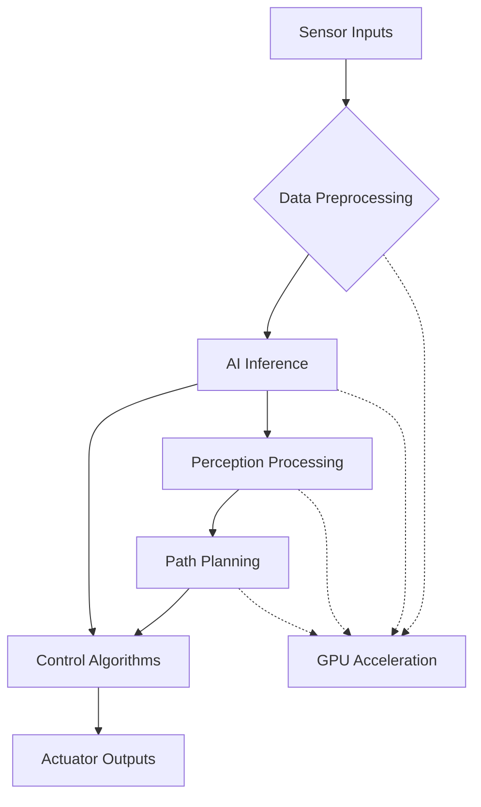

# Edge Deployment & Optimization
## Overview
Edge deployment represents the critical step of moving AI-powered Robotic Systems from development environments to real-world applications. This chapter explores the deployment of NVIDIA Isaac applications on edge computing platforms, particularly the Jetson series, focusing on optimization techniques for real-time performance, power efficiency, and reliability in resource-constrained environments.

Edge deployment requires careful consideration of computational constraints, power limitations, thermal management, and real-time performance requirements that characterize robotic applications.

## Jetson Platform Architecture
### Jetson Hardware Overview
The NVIDIA Jetson platform provides AI computing capabilities optimized for edge robotics:

#### Jetson Orin Series
- **Jetson Orin AGX**: Up to 275 TOPS for AI inference
- **Jetson Orin NX**: Up to 100 TOPS with smaller form factor
- **Jetson Orin Nano**: Up to 40 TOPS for entry-level applications

#### Key Hardware Components
- **GPU**: NVIDIA Ampere architecture with Tensor Cores
- **CPU**: ARM-based multi-core processors
- **DLA**: Dedicated Deep Learning Accelerators
- **VPU**: Video Processing Units for multimedia processing
- **Memory**: LPDDR5 with high bandwidth for AI workloads

### Compute Architecture for Robotics
The Jetson architecture is specifically designed for robotics applications:



## Deployment Strategies
### Container-Based Deployment
Docker containers provide consistent deployment across development and production environments:

```dockerfile
# Dockerfile for Isaac application on Jetson
FROM nvcr.io/nvidia/isaac-ros:galactic-ros-base-l4t-r35.2.1

# Set environment variables
ENV DEBIAN_FRONTEND=noninteractive
ENV NVIDIA_VISIBLE_DEVICES=all
ENV NVIDIA_DRIVER_CAPABILITIES=compute,utility

# Install dependencies
RUN apt-get update && apt-get install -y \
    python3-pip \
    python3-dev \
    build-essential \
    && rm -rf /var/lib/apt/lists/*

# Copy application code
COPY . /app
WORKDIR /app

# Install Python dependencies
RUN pip3 install -r requirements.txt

# Set up ROS workspace
COPY src /opt/ros_ws/src
RUN cd /opt/ros_ws && colcon build --packages-select my_robot_app

# Source ROS environment
SHELL ["/bin/bash", "-c"]
RUN echo "source /opt/ros_ws/install/setup.bash" >> ~/.bashrc

CMD ["ros2", "launch", "my_robot_app", "deploy.launch.py"]
```

### Isaac ROS Hardware Acceleration
Leverage hardware acceleration for optimal performance:

#### GPU-Accelerated Nodes
```python
# Isaac ROS GPU-accelerated node example
import rclpy
from rclpy.node import Node
from sensor_msgs.msg import Image
from cv_bridge import CvBridge
import torch
import torch_tensorrt

class IsaacGPUPerceptionNode(Node):
    def __init__(self):
        super().__init__('isaac_gpu_perception')

        # Initialize CUDA context
        if torch.cuda.is_available():
            self.device = torch.device('cuda')
            self.get_logger().info('CUDA acceleration enabled')
        else:
            self.device = torch.device('cpu')
            self.get_logger().warn('CUDA not available, using CPU')

        # Load and optimize model with TensorRT
        self.model = self.load_optimized_model()

        # Initialize subscribers
        self.image_sub = self.create_subscription(
            Image,
            '/camera/image_raw',
            self.image_callback,
            10
        )

        # Initialize CV bridge
        self.cv_bridge = CvBridge()

    def load_optimized_model(self):
        # Load pre-trained model
        model = torch.hub.load('pytorch/vision:v0.10.0',
                              'deeplabv3_resnet50',
                              pretrained=True)
        model.eval()

        # Optimize with TensorRT
        example_input = torch.randn(1, 3, 480, 640).to(self.device)

        traced_model = torch.jit.trace(model, example_input)

        optimized_model = torch_tensorrt.compile(
            traced_model,
            inputs=[example_input],
            enabled_precisions={torch.float, torch.half},
            workspace_size=1 << 20  # 1MB workspace
        )

        return optimized_model

    def image_callback(self, msg):
        try:
            # Convert ROS image to tensor
            cv_image = self.cv_bridge.imgmsg_to_cv2(msg, 'bgr8')
            tensor_image = self.preprocess_image(cv_image)

            # Run inference on GPU
            with torch.no_grad():
                result = self.model(tensor_image)

            # Process results
            self.process_inference_result(result)

        except Exception as e:
            self.get_logger().error(f'Error in GPU processing: {e}')

    def preprocess_image(self, image):
        # Preprocess image for model input
        image_tensor = torch.from_numpy(image).permute(2, 0, 1).float()
        image_tensor = image_tensor.unsqueeze(0).to(self.device) / 255.0
        return image_tensor

    def process_inference_result(self, result):
        # Process inference results
        # This would typically publish results to other nodes
        pass
```

#### Hardware Interface Optimization
```python
# Optimized hardware interface
import rclpy
from rclpy.node import Node
from sensor_msgs.msg import Imu, LaserScan
from geometry_msgs.msg import Twist
import numpy as np
import threading
from collections import deque

class OptimizedHardwareInterface(Node):
    def __init__(self):
        super().__init__('optimized_hardware_interface')

        # Optimize data structures for real-time performance
        self.imu_buffer = deque(maxlen=10)
        self.scan_buffer = deque(maxlen=5)

        # Hardware interfaces
        self.imu_sub = self.create_subscription(Imu, '/imu/data',
                                               self.imu_callback, 1)
        self.scan_sub = self.create_subscription(LaserScan, '/scan',
                                                self.scan_callback, 1)
        self.cmd_pub = self.create_publisher(Twist, '/cmd_vel', 1)

        # Real-time timer for control loop
        self.control_timer = self.create_timer(0.01, self.control_loop)  # 100Hz

        # Lock for thread safety
        self.data_lock = threading.Lock()

        # Pre-allocated arrays for performance
        self.processed_scan = np.empty(360, dtype=np.float32)

    def imu_callback(self, msg):
        with self.data_lock:
            self.imu_buffer.append({
                'orientation': [msg.orientation.x, msg.orientation.y,
                               msg.orientation.z, msg.orientation.w],
                'angular_velocity': [msg.angular_velocity.x,
                                   msg.angular_velocity.y,
                                   msg.angular_velocity.z],
                'linear_acceleration': [msg.linear_acceleration.x,
                                      msg.linear_acceleration.y,
                                      msg.linear_acceleration.z]
            })

    def scan_callback(self, msg):
        with self.data_lock:
            # Efficiently copy scan data
            self.processed_scan[:len(msg.ranges)] = msg.ranges
            self.processed_scan[len(msg.ranges):] = np.inf

    def control_loop(self):
        with self.data_lock:
            # Real-time control logic
            cmd = self.compute_control_command()

        if cmd is not None:
            self.cmd_pub.publish(cmd)

    def compute_control_command(self):
        # Optimized control computation
        # This would implement the actual control algorithm
        cmd = Twist()
        cmd.linear.x = 0.5  # Placeholder
        cmd.angular.z = 0.1  # Placeholder
        return cmd
```

## Performance Optimization Techniques
### Model Optimization
#### TensorRT Optimization
```python
import tensorrt as trt
import pycuda.driver as cuda
import pycuda.autoinit
import numpy as np

class TensorRTOptimizer:
    def __init__(self):
        self.logger = trt.Logger(trt.Logger.WARNING)
        self.runtime = trt.Runtime(self.logger)

    def optimize_model(self, onnx_model_path, output_path,
                      input_shape, precision='fp16'):
        """
        Optimize ONNX model for TensorRT deployment
        """
        # Create builder and network
        builder = trt.Builder(self.logger)
        network = builder.create_network(
            1 << int(trt.NetworkDefinitionCreationFlag.EXPLICIT_BATCH)
        )
        parser = trt.OnnxParser(network, self.logger)

        # Parse ONNX model
        with open(onnx_model_path, 'rb') as model_file:
            if not parser.parse(model_file.read()):
                for error in range(parser.num_errors):
                    print(parser.get_error(error))
                return False

        # Configure optimization
        config = builder.create_builder_config()

        # Set precision
        if precision == 'fp16':
            config.set_flag(trt.BuilderFlag.FP16)
        elif precision == 'int8':
            config.set_flag(trt.BuilderFlag.INT8)
            # Add calibration for INT8

        # Set memory limit
        config.max_workspace_size = 1 << 30  # 1GB

        # Build engine
        serialized_engine = builder.build_serialized_network(network, config)

        # Save optimized engine
        with open(output_path, 'wb') as f:
            f.write(serialized_engine)

        return True

    def create_inference_context(self, engine_path):
        """
        Create inference context for optimized model
        """
        with open(engine_path, 'rb') as f:
            engine_data = f.read()

        engine = self.runtime.deserialize_cuda_engine(engine_data)
        context = engine.create_execution_context()

        return engine, context
```

#### Model Quantization
```python
import torch
import torch.quantization as quantization

class ModelQuantizer:
    def __init__(self):
        self.quantized_model = None

    def quantize_model(self, model, calibration_data_loader):
        """
        Quantize model for edge deployment
        """
        # Set model to evaluation mode
        model.eval()

        # Specify quantization configuration
        model.qconfig = quantization.get_default_qconfig('fbgemm')

        # Prepare model for quantization
        quantization.prepare(model, inplace=True)

        # Calibrate the model
        self.calibrate_model(model, calibration_data_loader)

        # Convert to quantized model
        quantized_model = quantization.convert(model, inplace=False)

        return quantized_model

    def calibrate_model(self, model, data_loader):
        """
        Calibrate model with sample data
        """
        model.eval()
        with torch.no_grad():
            for i, (data, _) in enumerate(data_loader):
                if i >= 100:  # Use first 100 batches for calibration
                    break
                model(data)

    def dynamic_quantization(self, model):
        """
        Apply dynamic quantization to model
        """
        quantized_model = quantization.quantize_dynamic(
            model,
            {torch.nn.Linear, torch.nn.LSTM},
            dtype=torch.qint8
        )
        return quantized_model
```

### Memory Management
#### Efficient Memory Allocation
```python
import numpy as np
from numba import cuda
import threading

class MemoryManager:
    def __init__(self, device_memory_size=1<<30):  # 1GB
        self.device_memory_size = device_memory_size
        self.memory_pool = {}
        self.lock = threading.Lock()

        # Initialize GPU context
        self.gpu_initialized = cuda.is_available()

    def allocate_buffer(self, shape, dtype, device='cpu'):
        """
        Efficiently allocate memory buffer
        """
        key = (shape, dtype, device)

        with self.lock:
            if key in self.memory_pool:
                # Reuse existing buffer
                buffer = self.memory_pool[key].pop()
                if len(self.memory_pool[key]) == 0:
                    del self.memory_pool[key]
                return buffer

        # Create new buffer
        if device == 'gpu' and self.gpu_initialized:
            return cuda.device_array(shape, dtype=dtype)
        else:
            return np.empty(shape, dtype=dtype)

    def release_buffer(self, buffer, shape, dtype, device='cpu'):
        """
        Release buffer back to pool
        """
        key = (shape, dtype, device)

        with self.lock:
            if key not in self.memory_pool:
                self.memory_pool[key] = []
            self.memory_pool[key].append(buffer)

    def get_memory_stats(self):
        """
        Get memory usage statistics
        """
        stats = {
            'cpu_pools': len(self.memory_pool),
            'gpu_available': self.gpu_initialized
        }
        return stats
```

## Real-Time Performance
### Real-Time Scheduling
```python
import rclpy
from rclpy.node import Node
from rclpy.qos import QoSProfile, DurabilityPolicy
import threading
import time
import os

class RealTimeNode(Node):
    def __init__(self):
        super().__init__('real_time_node')

        # Configure real-time parameters
        self.configure_real_time()

        # Create high-frequency timer
        self.timer = self.create_timer(
            0.005,  # 200Hz
            self.real_time_callback,
            clock=self.get_clock()
        )

        # Set up QoS for real-time performance
        self.qos_profile = QoSProfile(
            depth=1,
            durability=DurabilityPolicy.VOLATILE
        )

    def configure_real_time(self):
        """
        Configure real-time scheduling
        """
        try:
            # Set CPU affinity to dedicated core
            os.sched_setaffinity(0, [0])  # Run on CPU 0

            # Set real-time priority (requires root privileges)
            import os
            import ctypes
            from ctypes import util

            # Load libc
            libc = ctypes.CDLL(util.find_library("c"))

            # Set real-time scheduling (SCHED_FIFO)
            param = ctypes.c_int(99)  # Max priority
            result = libc.sched_setscheduler(
                os.getpid(),
                ctypes.c_int(1),  # SCHED_FIFO
                ctypes.byref(param)
            )

            if result != 0:
                self.get_logger().warn('Could not set real-time scheduling')

        except Exception as e:
            self.get_logger().warn(f'Real-time config failed: {e}')

    def real_time_callback(self):
        """
        Real-time critical callback
        """
        start_time = self.get_clock().now()

        # Process time-critical tasks
        self.process_critical_task()

        # Calculate execution time
        end_time = self.get_clock().now()
        execution_time = (end_time - start_time).nanoseconds / 1e9

        # Log timing for analysis
        if execution_time > 0.004:  # 4ms threshold
            self.get_logger().warn(
                f'Task exceeded timing budget: {execution_time:.3f}s'
            )
```

### Pipeline Optimization
```python
import asyncio
import concurrent.futures
from collections import deque
import threading

class OptimizedPipeline:
    def __init__(self, num_threads=4):
        self.num_threads = num_threads
        self.thread_pool = concurrent.futures.ThreadPoolExecutor(
            max_workers=num_threads
        )
        self.pipeline_stages = []
        self.buffers = {}

    def add_stage(self, func, buffer_size=10):
        """
        Add processing stage to pipeline
        """
        stage_id = len(self.pipeline_stages)
        self.pipeline_stages.append({
            'function': func,
            'buffer': deque(maxlen=buffer_size),
            'stage_id': stage_id
        })

    async def process_pipeline(self, input_data):
        """
        Process data through optimized pipeline
        """
        # Process through each stage
        current_data = input_data

        for stage in self.pipeline_stages:
            # Submit to thread pool for parallel processing
            future = self.thread_pool.submit(
                stage['function'],
                current_data
            )

            # Wait for result
            current_data = future.result()

        return current_data

    def start_streaming_pipeline(self, input_stream):
        """
        Start continuous streaming pipeline
        """
        async def stream_processor():
            async for data in input_stream:
                # Process asynchronously
                result = await self.process_pipeline(data)

                # Yield result
                yield result

        return stream_processor()
```

## Power and Thermal Management
### Power Optimization
```python
import subprocess
import time
import threading

class PowerManager:
    def __init__(self):
        self.power_mode = 'balanced'
        self.monitoring = False
        self.power_monitor_thread = None

    def set_power_mode(self, mode):
        """
        Set Jetson power mode (nvpmodel)
        """
        modes = {
            'max_performance': 'MAXN',
            'balanced': 'MODE_15W',  # Or appropriate mode for device
            'power_efficient': 'MODE_10W'
        }

        if mode in modes:
            try:
                subprocess.run(['nvpmodel', '-m', modes[mode]], check=True)
                self.power_mode = mode
                return True
            except subprocess.CalledProcessError:
                return False
        return False

    def start_power_monitoring(self):
        """
        Start power consumption monitoring
        """
        self.monitoring = True
        self.power_monitor_thread = threading.Thread(
            target=self._monitor_power_consumption
        )
        self.power_monitor_thread.start()

    def _monitor_power_consumption(self):
        """
        Monitor power consumption in background
        """
        while self.monitoring:
            try:
                # Read power consumption from Jetson files
                with open('/sys/bus/i2c/devices/0-0040/hwmon/hwmon0/power1_input', 'r') as f:
                    power_mw = int(f.read().strip())

                # Log or take action based on power consumption
                if power_mw > 15000:  # 15W threshold
                    self.throttle_computation()

            except Exception as e:
                pass  # Handle gracefully

            time.sleep(1)  # Monitor every second

    def throttle_computation(self):
        """
        Reduce computation to save power
        """
        # Reduce processing frequency
        # Lower model precision
        # Skip non-critical processing
        pass
```

### Thermal Management
```python
import subprocess
import threading
import time

class ThermalManager:
    def __init__(self):
        self.max_temp = 85.0  # Celsius
        self.current_temp = 0.0
        self.cooling_active = False

    def get_jetson_temperature(self):
        """
        Get current Jetson temperature
        """
        try:
            # Read from thermal zones
            with open('/sys/class/thermal/thermal_zone0/temp', 'r') as f:
                temp_mC = int(f.read().strip())  # Temperature in milli-Celsius
                return temp_mC / 1000.0  # Convert to Celsius
        except Exception:
            return 0.0

    def thermal_protection_loop(self):
        """
        Continuous thermal monitoring loop
        """
        while True:
            current_temp = self.get_jetson_temperature()
            self.current_temp = current_temp

            if current_temp > self.max_temp:
                self.trigger_thermal_protection()
            elif current_temp < (self.max_temp - 5):  # Hysteresis
                self.restore_normal_operation()

            time.sleep(2)  # Check every 2 seconds

    def trigger_thermal_protection(self):
        """
        Activate thermal protection measures
        """
        if not self.cooling_active:
            self.cooling_active = True
            # Reduce CPU/GPU frequency
            # Throttle AI inference
            # Reduce processing pipeline complexity
            print("Thermal protection activated")

    def restore_normal_operation(self):
        """
        Restore normal operation when temperature drops
        """
        if self.cooling_active:
            self.cooling_active = False
            # Restore normal frequencies
            # Resume full processing
            print("Normal operation restored")
```

## Deployment Validation
### Performance Testing
```python
import time
import statistics
from collections import deque

class PerformanceValidator:
    def __init__(self, node):
        self.node = node
        self.metrics = {
            'latency': deque(maxlen=1000),
            'throughput': deque(maxlen=1000),
            'memory_usage': deque(maxlen=1000),
            'cpu_usage': deque(maxlen=1000)
        }

    def benchmark_inference(self, model, test_data, num_runs=100):
        """
        Benchmark model inference performance
        """
        latencies = []

        for i in range(num_runs):
            start_time = time.perf_counter()

            # Run inference
            with torch.no_grad():
                result = model(test_data)

            end_time = time.perf_counter()
            latency = (end_time - start_time) * 1000  # ms
            latencies.append(latency)

        # Calculate statistics
        stats = {
            'mean_latency': statistics.mean(latencies),
            'median_latency': statistics.median(latencies),
            'std_latency': statistics.stdev(latencies) if len(latencies) > 1 else 0,
            'min_latency': min(latencies),
            'max_latency': max(latencies),
            '95th_percentile': sorted(latencies)[int(0.95 * len(latencies))]
        }

        return stats

    def validate_real_time_performance(self, duration=60):
        """
        Validate real-time performance over extended period
        """
        start_time = time.time()
        cycle_times = []

        while time.time() - start_time < duration:
            cycle_start = time.perf_counter()

            # Execute real-time task
            self.execute_real_time_task()

            cycle_end = time.perf_counter()
            cycle_time = (cycle_end - cycle_start) * 1000  # ms
            cycle_times.append(cycle_time)

        # Analyze results
        avg_cycle_time = statistics.mean(cycle_times)
        max_cycle_time = max(cycle_times)
        missed_deadlines = sum(1 for t in cycle_times if t > 10)  # >10ms deadline

        return {
            'avg_cycle_time': avg_cycle_time,
            'max_cycle_time': max_cycle_time,
            'missed_deadlines': missed_deadlines,
            'deadline_miss_rate': missed_deadlines / len(cycle_times)
        }

    def execute_real_time_task(self):
        """
        Execute a representative real-time task
        """
        # Placeholder for actual task
        time.sleep(0.001)  # Simulate 1ms task
```

### Resource Utilization Monitoring
```python
import psutil
import GPUtil
import threading
import time
from collections import deque

class ResourceMonitor:
    def __init__(self, interval=1.0):
        self.interval = interval
        self.monitoring = False
        self.stats = {
            'cpu_percent': deque(maxlen=300),  # 5 minutes at 1Hz
            'memory_percent': deque(maxlen=300),
            'gpu_percent': deque(maxlen=300),
            'gpu_memory': deque(maxlen=300)
        }

    def start_monitoring(self):
        """
        Start resource monitoring in background thread
        """
        self.monitoring = True
        self.monitor_thread = threading.Thread(target=self._monitor_loop)
        self.monitor_thread.start()

    def _monitor_loop(self):
        """
        Background monitoring loop
        """
        while self.monitoring:
            # CPU usage
            cpu_percent = psutil.cpu_percent(interval=0.1)

            # Memory usage
            memory_info = psutil.virtual_memory()
            memory_percent = memory_info.percent

            # GPU usage (if available)
            gpus = GPUtil.getGPUs()
            if gpus:
                gpu = gpus[0]  # Primary GPU
                gpu_percent = gpu.load * 100
                gpu_memory = gpu.memoryUtil * 100
            else:
                gpu_percent = 0
                gpu_memory = 0

            # Store statistics
            self.stats['cpu_percent'].append(cpu_percent)
            self.stats['memory_percent'].append(memory_percent)
            self.stats['gpu_percent'].append(gpu_percent)
            self.stats['gpu_memory'].append(gpu_memory)

            time.sleep(self.interval)

    def get_current_stats(self):
        """
        Get current resource utilization
        """
        if not self.stats['cpu_percent']:
            return {}

        return {
            'cpu_percent': self.stats['cpu_percent'][-1],
            'memory_percent': self.stats['memory_percent'][-1],
            'gpu_percent': self.stats['gpu_percent'][-1],
            'gpu_memory': self.stats['gpu_memory'][-1],
            'cpu_avg': sum(self.stats['cpu_percent']) / len(self.stats['cpu_percent']),
            'memory_avg': sum(self.stats['memory_percent']) / len(self.stats['memory_percent'])
        }
```

## Deployment Best Practices
### Configuration Management
```yaml
# deployment_config.yaml
deployment:
  platform: "jetson-orin"
  mode: "production"

optimization:
  precision: "fp16"
  batch_size: 1
  max_workspace_size: "1GB"

real_time:
  control_frequency: 100
  max_latency: 10  # ms
  watchdog_timeout: 500  # ms

resources:
  cpu_affinity: [0, 1]
  gpu_memory_fraction: 0.8
  memory_limit: "2GB"

monitoring:
  enabled: true
  log_level: "INFO"
  metrics_collection: true
```

### Deployment Scripts
```bash
#!/bin/bash
# deploy_isaac_app.sh

set -e  # Exit on error

echo "Starting Isaac application deployment..."

# Check prerequisites
if ! command -v docker &> /dev/null; then
    echo "Docker is required but not installed"
    exit 1
fi

if ! nvidia-smi &> /dev/null; then
    echo "NVIDIA drivers not found"
    exit 1
fi

# Set power mode for optimal performance
echo "Setting power mode..."
sudo nvpmodel -m MAXN

# Configure Jetson clocks
echo "Configuring clocks..."
sudo jetson_clocks

# Build Docker image
echo "Building Docker image..."
docker build -t isaac-robot-app:latest .

# Run the application
echo "Starting application..."
docker run -it --rm \
    --gpus all \
    --privileged \
    --network host \
    --env NVIDIA_VISIBLE_DEVICES=all \
    --env NVIDIA_DRIVER_CAPABILITIES=compute,utility \
    --volume /tmp:/tmp \
    --device /dev:/dev \
    isaac-robot-app:latest

echo "Deployment completed!"
```

## Troubleshooting and Debugging
### Common Deployment Issues
#### Memory Issues
- **Insufficient GPU memory**: Optimize model size or reduce batch size
- **Memory fragmentation**: Restart application or use memory pools
- **Memory leaks**: Monitor memory usage and fix resource management

#### Performance Issues
- **High latency**: Profile code and optimize bottlenecks
- **Low throughput**: Increase parallelism or optimize algorithms
- **Thermal throttling**: Improve cooling or reduce computational load

#### Hardware Issues
- **Sensor connectivity**: Check physical connections and drivers
- **Power delivery**: Verify adequate power supply for peak loads
- **Thermal management**: Ensure proper cooling and ventilation

## Summary
Edge deployment optimization is crucial for successful robotic applications. The NVIDIA Jetson platform, combined with Isaac's optimization tools, provides the foundation for deploying sophisticated AI-powered Robotic Systems in real-world environments.

Successful deployment requires careful attention to performance optimization, resource management, real-time constraints, and environmental factors. The techniques covered in this chapter provide a framework for deploying efficient, reliable Robotic Systems that can operate effectively in their intended environments.

In the next chapters, we'll explore how these deployment strategies integrate with the broader robotic system architecture, including perception, planning, and control systems.