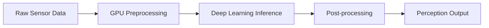

# NVIDIA Isaac Platform & Perception

## Overview

The NVIDIA Isaac platform represents a comprehensive solution for developing, simulating, and deploying AI-powered robotic applications. Built on NVIDIA's extensive GPU computing expertise, Isaac provides the tools and frameworks necessary to create sophisticated perception systems that enable robots to understand and interact with their environment.

This chapter explores the architecture of the NVIDIA Isaac platform, focusing on perception capabilities that form the "sensory" foundation of AI-powered robotic systems. We'll examine how Isaac transforms raw sensor data into meaningful environmental understanding.

## Isaac Platform Architecture

### Isaac ROS: Bridging Simulation and Reality

Isaac ROS is a collection of hardware-accelerated ROS 2 packages that bridge the gap between NVIDIA's AI computing platform and the Robot Operating System. These packages leverage GPU acceleration to provide high-performance perception, navigation, and manipulation capabilities.

Key components include:

- **Isaac ROS Image Pipelines**: GPU-accelerated image processing for real-time computer vision
- **Isaac ROS Perception**: Object detection, segmentation, and pose estimation
- **Isaac ROS Navigation**: GPU-accelerated path planning and obstacle avoidance
- **Isaac ROS Manipulation**: Motion planning and control for robotic arms

### Isaac Sim: Advanced Simulation Environment

Isaac Sim provides a photorealistic simulation environment built on NVIDIA Omniverse. It enables:

- **Physics-based simulation**: Accurate modeling of real-world physics
- **Photorealistic rendering**: High-fidelity visual simulation for training
- **Synthetic data generation**: Large-scale dataset creation for AI training
- **Domain randomization**: Techniques to improve sim-to-real transfer

### Isaac Apps: Pre-built Solutions

NVIDIA provides pre-built applications that demonstrate best practices:

- **Isaac Nova Carter**: Reference autonomous mobile robot platform
- **Isaac Carter**: Mobile manipulator reference platform
- **Isaac Malicious**: AI-powered perception and manipulation platform

## Perception Fundamentals

### Sensor Integration

Robotic perception begins with sensor data integration. Isaac supports multiple sensor types:

- **RGB Cameras**: Visual information for object recognition and scene understanding
- **Depth Sensors**: 3D spatial information for navigation and manipulation
- **LiDAR**: Precise distance measurements for mapping and obstacle detection
- **IMU**: Inertial measurements for motion tracking and stabilization
- **GPS**: Global positioning for outdoor navigation

### Computer Vision in Robotics

Isaac leverages state-of-the-art computer vision techniques optimized for robotics:

#### Object Detection and Recognition

- **YOLO (You Only Look Once)**: Real-time object detection optimized for edge deployment
- **DetectNet**: NVIDIA's specialized object detection for robotics applications
- **Pose Estimation**: 6D pose estimation for objects in 3D space

#### Semantic Segmentation

- **SegNet**: Pixel-level scene understanding for navigation and interaction
- **RoadNet**: Specialized for autonomous driving and navigation scenarios
- **Enet**: Lightweight segmentation for real-time applications

#### 3D Reconstruction

- **Stereo Vision**: Depth estimation from stereo camera pairs
- **Structure from Motion (SfM)**: 3D reconstruction from 2D image sequences
- **SLAM Integration**: Simultaneous localization and mapping with 3D understanding

## Isaac Perception Pipelines

### GPU-Accelerated Processing

Isaac's perception pipelines are designed to take full advantage of GPU acceleration:



### Isaac ROS Perception Nodes

#### Isaac ROS Apriltag

Detects AprilTag fiducial markers for precise pose estimation:

```python
from isaac_ros_apriltag_interfaces.msg import AprilTagDetectionArray
import rclpy
from rclpy.node import Node

class AprilTagProcessor(Node):
    def __init__(self):
        super().__init__('apriltag_processor')
        self.subscription = self.create_subscription(
            AprilTagDetectionArray,
            '/apriltag_detections',
            self.detection_callback,
            10
        )

    def detection_callback(self, msg):
        for detection in msg.detections:
            # Process tag pose and ID
            pose = detection.pose
            tag_id = detection.id
            # Use for robot localization or object tracking
```

#### Isaac ROS Stereo Disparity

Generates depth information from stereo camera pairs:

- **Semi-Global Block Matching (SGBM)**: GPU-accelerated stereo matching
- **Real-time performance**: Up to 60 FPS on Jetson platforms
- **Sub-pixel accuracy**: Precise depth measurements for manipulation

#### Isaac ROS Image Pipeline

Optimizes image processing for robotics applications:

- **Hardware-accelerated color conversion**
- **GPU-based image rectification**
- **Multi-camera synchronization**
- **Real-time image compression/decompression**

## AI Model Integration

### TensorRT Optimization

Isaac integrates with TensorRT for optimized inference:

- **Model quantization**: INT8 optimization for edge deployment
- **Dynamic batching**: Efficient processing of variable input sizes
- **Multi-GPU scaling**: Distribution across multiple GPU devices
- **Memory optimization**: Efficient GPU memory usage

### Model Deployment on Jetson

The Jetson platform enables edge AI deployment:

#### Jetson Orin Architecture

- **Ampere GPU**: Up to 275 TOPS for AI inference
- **ARM CPU**: Multi-core processor for system control
- **Deep Learning Accelerator**: Dedicated cores for neural network inference
- **Video Processing Units**: Hardware acceleration for video processing

#### Deployment Strategies

- **Edge AI**: Local processing for real-time response
- **Cloud offloading**: Complex processing to cloud when connectivity available
- **Hybrid approach**: Critical functions local, complex analysis distributed

## Perception for Navigation

### Visual SLAM Integration

Isaac provides robust visual SLAM capabilities:

- **ORB-SLAM integration**: Feature-based visual SLAM
- **Direct SLAM**: Direct method for texture-poor environments
- **Visual-inertial fusion**: Combining visual and IMU data
- **Loop closure**: Recognition of previously visited locations

### Obstacle Detection and Avoidance

#### 2D Obstacle Detection

- **LiDAR-based**: Precise distance measurements
- **Vision-based**: Semantic understanding of obstacles
- **Fusion approaches**: Combining multiple sensor modalities

#### 3D Scene Understanding

- **Occupancy grids**: 3D representation of free/occupied space
- **Traversability analysis**: Assessment of terrain for navigation
- **Path planning integration**: Real-time obstacle-aware path planning

## Hands-on Example: Object Detection Pipeline

Let's implement a basic object detection pipeline using Isaac ROS:

```python
# Isaac ROS Object Detection Example
import rclpy
from rclpy.node import Node
from sensor_msgs.msg import Image
from vision_msgs.msg import Detection2DArray
from cv_bridge import CvBridge
import cv2
import numpy as np

class IsaacObjectDetector(Node):
    def __init__(self):
        super().__init__('isaac_object_detector')

        # Initialize CV bridge
        self.cv_bridge = CvBridge()

        # Create subscribers and publishers
        self.image_sub = self.create_subscription(
            Image,
            '/camera/color/image_raw',
            self.image_callback,
            10
        )

        self.detection_pub = self.create_publisher(
            Detection2DArray,
            '/isaac_object_detections',
            10
        )

        # Initialize Isaac-compatible detection pipeline
        self.get_logger().info('Isaac Object Detector initialized')

    def image_callback(self, msg):
        try:
            # Convert ROS image to OpenCV format
            cv_image = self.cv_bridge.imgmsg_to_cv2(msg, 'bgr8')

            # Process with Isaac-accelerated pipeline
            detections = self.process_image(cv_image)

            # Publish detections
            self.publish_detections(detections)

        except Exception as e:
            self.get_logger().error(f'Error processing image: {e}')

    def process_image(self, image):
        # Placeholder for Isaac-accelerated processing
        # In a real implementation, this would use Isaac ROS nodes
        # or GPU-accelerated inference
        pass

    def publish_detections(self, detections):
        # Publish detections in Isaac-compatible format
        pass

def main(args=None):
    rclpy.init(args=args)
    detector = IsaacObjectDetector()

    try:
        rclpy.spin(detector)
    except KeyboardInterrupt:
        detector.get_logger().info('Shutting down Isaac Object Detector')
    finally:
        detector.destroy_node()
        rclpy.shutdown()

if __name__ == '__main__':
    main()
```

## Performance Considerations

### Real-time Processing Requirements

Robotic perception systems must meet strict real-time requirements:

- **Camera frame rates**: 30-60 FPS for smooth visual processing
- **Control loop timing**: 10-100 Hz for responsive robot control
- **Latency constraints**: `<100ms` end-to-end processing for safety
- **Throughput**: Ability to process multiple sensors simultaneously

### GPU Memory Management

Efficient GPU memory usage is crucial:

- **Memory pooling**: Reuse GPU memory allocations
- **Streaming**: Process data in streams rather than batches
- **Precision optimization**: Use appropriate precision for different tasks
- **Memory bandwidth**: Optimize memory access patterns

## Integration with Control Systems

### Perception-Action Coupling

Effective robotics requires tight integration between perception and action:

- **Feedback control**: Use perception to guide control actions
- **Predictive control**: Anticipate environmental changes
- **Adaptive behavior**: Modify behavior based on environmental understanding
- **Safety systems**: Perception-based safety checks and emergency responses

### Multi-Sensor Fusion

Combine information from multiple sensors:

- **Kalman filtering**: Optimal state estimation from multiple sources
- **Particle filtering**: Non-linear state estimation for complex environments
- **Sensor validation**: Verify sensor reliability and consistency
- **Fault tolerance**: Continue operation with partial sensor failures

## Quality Assurance and Validation

### Perception Accuracy Metrics

Evaluate perception system performance:

- **Precision and recall**: For object detection and classification
- **IoU (Intersection over Union)**: For segmentation accuracy
- **Reprojection error**: For pose estimation accuracy
- **Timing accuracy**: For temporal synchronization

### Testing Methodologies

- **Synthetic data testing**: Use Isaac Sim to generate diverse test scenarios
- **Real-world validation**: Test on actual hardware in real environments
- **Edge case testing**: Verify performance in challenging conditions
- **Regression testing**: Ensure updates don't degrade performance

## Summary

The NVIDIA Isaac platform provides a comprehensive foundation for AI-powered robotic perception. Its GPU-accelerated processing, extensive sensor integration, and optimized deployment tools make it ideal for creating sophisticated perception systems that enable robots to understand and interact with their environment.

In the next chapter, we'll explore motion planning and trajectory generation, which builds upon the perception foundation to enable robots to navigate and manipulate objects in their environment effectively.